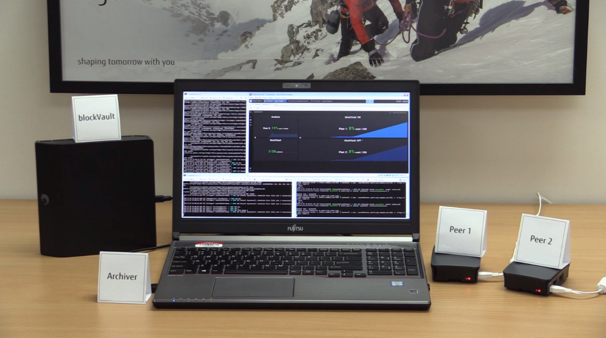
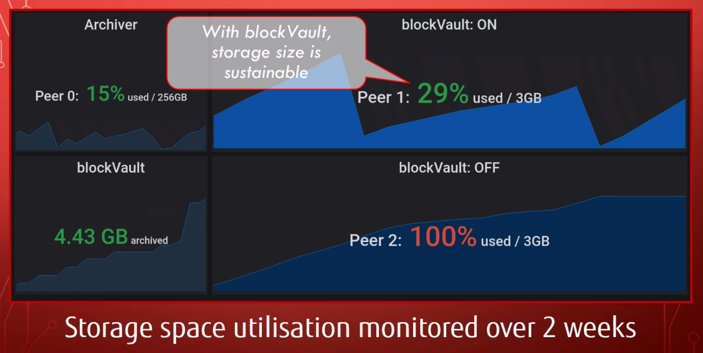

# Hyperledger Fabric Block Archiving

This enhancement for Hyperledger Fabric is aiming to:
* Reduce the total amount of storage space required for an organisation to operate a Hyperledger Fabric network by archiving block data into repository.
* For organisations, operate a Hyperledger Fabric network with low resourced nodes such as a IoT edge devices.


Please refer [the proposal](https://github.com/hyperledger-labs/hyperledger-labs.github.io/blob/master/labs/fabric-block-archiving.md) for more detail.

## Getting Started

To use this feature, you need to build hyperledger/fabric-peer container image and a repository container image to archive blocks on your local machine. In the next several steps, we are going to show you the steps how to build and bring up on your local environment for development purpose.

### Prerequisites

You need to meet the prerequisites described in the official Hyperledger Fabric document. 

* [Prerequisites](https://hyperledger-fabric.readthedocs.io/en/master/dev-setup/devenv.html#prerequisites)


### Setting up the development environment

Basically you only need to follow the steps described in the following page to setup development environment.

* [Steps](https://hyperledger-fabric.readthedocs.io/en/master/dev-setup/devenv.html#steps)

  There are some notes regarding to these steps:
  * Skip the steps related to setup for gerrit because we are using github
  * Clone source code from here ([hyperledger-labs/fabric-block-archiving](https://github.com/hyperledger-labs/fabric-block-archiving.git)), not from hyperledger/fabric on gerrit/github

### Building container image

You can use prebuild images for containers other than fabric-peer and fabric-blkvault-repo. So you don't need to do `make all`, as mentioned in [the document](https://hyperledger-fabric.readthedocs.io/en/master/dev-setup/build.html). You just need to do the following 2 commands.

```
vagrant@ubuntu:~/go/src/github.com/hyperledger/fabric$ make peer-docker
vagrant@ubuntu:~/go/src/github.com/hyperledger/fabric$ make blkvault-repo-docker
```

Now you should be able to see the following container images on your local machine.

```
vagrant@ubuntu:~/go/src/github.com/hyperledger/fabric$ docker images
REPOSITORY                         TAG                                  IMAGE ID            CREATED             SIZE
hyperledger/fabric-blkvault-repo   2.0.0-alpha                          129811011d3d        2 hours ago         202MB
hyperledger/fabric-blkvault-repo   amd64-2.0.0-alpha-snapshot-ea48f79   129811011d3d        2 hours ago         202MB
hyperledger/fabric-blkvault-repo   amd64-blkvault                       129811011d3d        2 hours ago         202MB
hyperledger/fabric-blkvault-repo   latest                               129811011d3d        2 hours ago         202MB
hyperledger/fabric-peer            2.0.0-alpha                          5b05d8d79382        2 hours ago         48.1MB
hyperledger/fabric-peer            amd64-2.0.0-alpha-snapshot-ea48f79   5b05d8d79382        2 hours ago         48.1MB
hyperledger/fabric-peer            amd64-blkvault                       5b05d8d79382        2 hours ago         48.1MB
hyperledger/fabric-peer            latest                               5b05d8d79382        2 hours ago         48.1MB
```
----
## Looking at how to work

### Clone Test suites for Block Archiving feature

All scripts to run the following simple demo are included https://github.com/nekia/fabric-block-archiving-testenv.git.

```
vagrant@ubuntu:~$ mkdir ~/dev
vagrant@ubuntu:~$ cd ~/dev
vagrant@ubuntu:~/dev$ git clone https://github.com/nekia/fabric-block-archiving-testenv.git
vagrant@ubuntu:~/dev$ cd fabric-block-archiving-testenv
```

### Download Hyperledger Fabric platform-specific binaries

In the following demo, a simple Hyperledger Fabric network is actually deployed on your local environment. It's based on fabric-samples/first-network example. You need to download some binaries required for that.

```
vagrant@ubuntu:~/dev/fabric-block-archiving-testenv$ curl -sSL http://bit.ly/2ysbOFE | bash -s -- 2.0.0-alpha 2.0.0-alpha 0.4.15 -s -d
```
* You need to bypass docker image download(-d) and fabric-samples repo clone(-s)
* If you would download docker image by mistake, it would override image tag of fabric-peer container image which is built for Block Archiving feature with the original one. In that case, you need to assign tag manually as below:

  ```
  vagrant@ubuntu:~/dev/fabric-block-archiving-testenv$ docker tag hyperledger/fabric-peer:amd64-blkvault hyperledger/fabric-peer:2.0.0-alpha
  vagrant@ubuntu:~/dev/fabric-block-archiving-testenv$ docker tag hyperledger/fabric-peer:amd64-blkvault hyperledger/fabric-peer:latest
  ```

### Clean up 

Stop and remove all containers which have been started and also delete all artifacts generated

```
vagrant@ubuntu:~/dev/fabric-block-archiving-testenv$ ./byfn.sh down
vagrant@ubuntu:~/dev/fabric-block-archiving-testenv$ sudo rm -rf ledgers/ ledgers-archived/
```

### Bring up network

Launch Hyperledger Fabric network (2 organizations, 2 peers for each)

```
vagrant@ubuntu:~/dev/fabric-block-archiving-testenv$ ./byfn.sh up -c mychannel
```

* Ledger files created on each peer are exposed on host file system ( under ~/dev/fabric-block-archiving-testenv/ledgers )
* Ledger files archived into a repository node are exposed on host file system ( under ~/dev/fabric-block-archiving-testenv/ledgers-archived )

### Add more channel

If you want to add more channel to the network, please follow the below steps to generate some artifacts for the newly added channel

```
vagrant@ubuntu:~/dev/fabric-block-archiving-testenv$ ./byfn.sh generatech -c yourchannel
```

### Setup netwok

Create a channel and make all peers joined into the channel

```
vagrant@ubuntu:~/dev/fabric-block-archiving-testenv$ docker exec -it cli scripts/script.sh
```

If you added more channel to the network, please follow the below steps to create channel and join it.

```
vagrant@ubuntu:~/dev/fabric-block-archiving-testenv$ docker exec -it cli scripts/script.sh yourchannel
```

### Generate transactions

You can issue many transactions repeatedly by the following one liner command

```
vagrant@ubuntu:~/dev/fabric-block-archiving-testenv$ for i in $(seq 1 10000); do docker exec -it cli scripts/script_write.sh; sleep 5; done
```

If you also want to invoke transactions into the channel you added more, please follow the below steps

```
vagrant@ubuntu:~/dev/fabric-block-archiving-testenv$ for i in $(seq 1 10000); do docker exec -it cli scripts/script_write.sh yourchannel; sleep 5; done
```

### Monitor stats overview of blockfiles

You can monitor the number of blockfiles for each org, each channel and each peer.

```
vagrant@ubuntu:~/dev/fabric-block-archiving-testenv$ watch -n 3 ./scripts/host/checkarchive.sh status
==== The number of archived blockfiles on blockVault ====
mychannel
  org1: 30
  org2: 30
yourchannel
  org1: 7
  org2: 30
==== The number of blockfiles on local file system ====
mychannel
  org1
    peer0: 40
    peer1: 40
    peer2: 0
    peer3: 0
    peer4: 0
  org2
    peer0: 40
    peer1: 40
    peer2: 0
    peer3: 0
    peer4: 0
yourchannel
  org1
    peer0: 34
    peer1: 33
    peer2: 0
    peer3: 0
    peer4: 0
  org2
    peer0: 13
    peer1: 33
    peer2: 0
    peer3: 0
    peer4: 0
```

You need to configure checkarchive.sh according to your network topology

```
vagrant@ubuntu:~/dev/fabric-block-archiving-testenv$ head scripts/checkarchive.sh 
#!/bin/bash
FABRIC_ROOT=$GOPATH/src/github.com/hyperledger/fabric
LOCAL_LEDGER_DIR=/home/vagrant/dev/fst-poc-fabric-env/ledgers
ORGS="org1 org2"
CHANNELS="mychannel yourchannel"
PEERS="peer0 peer1 peer2 peer3 peer4"
```

### Verify blockchain

You can verify the consistency of blockchain from each peer

```
vagrant@ubuntu:~/dev/fabric-block-archiving-testenv$ ./scripts/checkarchive.sh verify
mychannel
  org1
    peer0: {"pass":true,"channelID":"mychannel"}
    peer1: {"pass":true,"channelID":"mychannel"}
    peer2: Error: No such container: peer2.org1.example.com
    peer3: Error: No such container: peer3.org1.example.com
    peer4: Error: No such container: peer4.org1.example.com
  org2
    peer0: {"pass":true,"channelID":"mychannel"}
    peer1: {"pass":true,"channelID":"mychannel"}
    peer2: Error: No such container: peer2.org2.example.com
    peer3: Error: No such container: peer3.org2.example.com
    peer4: Error: No such container: peer4.org2.example.com
yourchannel
  org1
    peer0: {"pass":true,"channelID":"yourchannel"}
    peer1: {"pass":true,"channelID":"yourchannel"}
    peer2: Error: No such container: peer2.org1.example.com
    peer3: Error: No such container: peer3.org1.example.com
    peer4: Error: No such container: peer4.org1.example.com
  org2
    peer0: {"pass":true,"channelID":"yourchannel"}
    peer1: {"pass":true,"channelID":"yourchannel"}
    peer2: Error: No such container: peer2.org2.example.com
    peer3: Error: No such container: peer3.org2.example.com
    peer4: Error: No such container: peer4.org2.example.com
```

----
## Running end-to-end tests

Please refer [README-E2ETEST.md](./README-E2ETEST.md)

----

## Deployment

### Deploying on Raspberry Pi

(WIP)




## Authors

- [anand-jpa](https://github.com/anand-jpa) - Anand Konchery
- [chrism28](https://github.com/chrism28) - Chris Murphy
- [nekia](https://github.com/nekia) - Atsushi Neki

## License

This project is licensed under the Apache License Version 2.0 - see the [LICENSE.md](LICENSE.md) file for details


