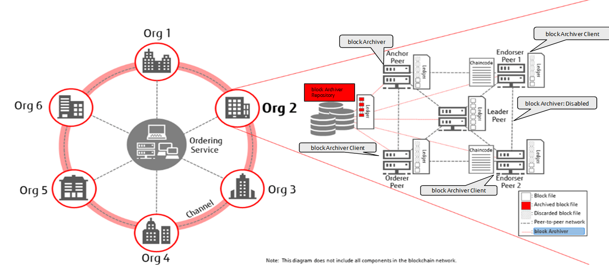

# Hyperledger Fabric Block Archiving

This enhancement for Hyperledger Fabric is aiming to:
* Reduce the total amount of storage space required for an organisation to operate a Hyperledger Fabric network by archiving block data into repository.
* For organisations, operate a Hyperledger Fabric network with low resourced nodes such as a IoT edge devices.



## Getting Started

To use this feature, you need to build hyperledger/fabric-peer container image and a repository container image to archive blocks on your local machine. In the next several steps, we are going to show you the steps how to build and bring up on your local environment for development purpose.

### Prerequisites

You need to meet the prerequisites described in the official Hyperledger Fabric document. 

* [Prerequisites](https://hyperledger-fabric.readthedocs.io/en/master/dev-setup/devenv.html#prerequisites)


### Setting up the development environment

Basically you only need to follow the steps described in the following page to setup development environment.

* [Steps](https://hyperledger-fabric.readthedocs.io/en/master/dev-setup/devenv.html#steps)

  There are some notes regarding to these steps:
  * Skip the steps related to setup for gerrit because we are using github
  * Clone source code from here ([hyperledger-labs/fabric-block-archiving](https://github.com/hyperledger-labs/fabric-block-archiving.git)), not from hyperledger/fabric on gerrit/github

### Building container image

You can use prebuild images for containers other than fabric-peer and fabric-blkvault-repo. So you don't need to do `make all`, as mentioned in [the document](https://hyperledger-fabric.readthedocs.io/en/master/dev-setup/build.html). You just need to do the following 2 commands.

```
vagrant@ubuntu:~/go/src/github.com/hyperledger/fabric$ make peer-docker
vagrant@ubuntu:~/go/src/github.com/hyperledger/fabric$ make blkvault-repo-docker
```

Now you should be able to see the following container images on your local machine.

```
vagrant@ubuntu:~/go/src/github.com/hyperledger/fabric$ docker images
REPOSITORY                         TAG                                  IMAGE ID            CREATED             SIZE
hyperledger/fabric-blkvault-repo   2.0.0-alpha                          129811011d3d        2 hours ago         202MB
hyperledger/fabric-blkvault-repo   amd64-2.0.0-alpha-snapshot-ea48f79   129811011d3d        2 hours ago         202MB
hyperledger/fabric-blkvault-repo   amd64-blkvault                       129811011d3d        2 hours ago         202MB
hyperledger/fabric-blkvault-repo   latest                               129811011d3d        2 hours ago         202MB
hyperledger/fabric-peer            2.0.0-alpha                          5b05d8d79382        2 hours ago         48.1MB
hyperledger/fabric-peer            amd64-2.0.0-alpha-snapshot-ea48f79   5b05d8d79382        2 hours ago         48.1MB
hyperledger/fabric-peer            amd64-blkvault                       5b05d8d79382        2 hours ago         48.1MB
hyperledger/fabric-peer            latest                               5b05d8d79382        2 hours ago         48.1MB
```
----
## Running the tests

### Clone Test suites for Block Archiving feature

```
vagrant@ubuntu:~$ mkdir ~/dev
vagrant@ubuntu:~$ cd ~/dev
vagrant@ubuntu:~/dev$ git clone https://github.com/nekia/fabric-block-archiving-testenv.git
vagrant@ubuntu:~/dev$ cd fabric-block-archiving-testenv
```

### Download Hyperledger Fabric platform-specific binaries

```
vagrant@ubuntu:~/dev/fabric-block-archiving-testenv$ curl -sSL http://bit.ly/2ysbOFE | bash -s -- 2.0.0-alpha 2.0.0-alpha 0.4.15 -s -d
```
* You need to bypass docker image download(-d) and fabric-samples repo clone(-s)

### Setup environment for end to end test

```
vagrant@ubuntu:~/dev/fabric-block-archiving-testenv$ virtualenv e2e-test
vagrant@ubuntu:~/dev/fabric-block-archiving-testenv$ . e2e-test/bin/activate
(e2e-test) vagrant@ubuntu:~/dev/fabric-block-archiving-testenv$ cd feature/
(e2e-test) vagrant@ubuntu:~/dev/fabric-block-archiving-testenv/feature$ pip install -r requirements.txt
```
* You need to install virtualenv (`apt-get install virtualenv`).

### Run end to end test

```
# Sanity check
(e2e-test) vagrant@ubuntu:~/dev/fabric-block-archiving-testenv/feature$ behave -t @dev -k blockArchiving.feature
# Full test (It takes about about 20 min to complete)
(e2e-test) vagrant@ubuntu:~/dev/fabric-block-archiving-testenv/feature$ behave -k blockArchiving.feature

(snip)

1 feature passed, 0 failed, 0 skipped
5 scenarios passed, 0 failed, 0 skipped
191 steps passed, 0 failed, 0 skipped, 0 undefined
Took 18m21.142s

vagrant@ubuntu:~/dev/fabric-block-archiving-testenv/feature$ deactivate
```
----
## Looking at how to work

### Clean up 

Stop and remove all containers have been started and also delete all artifacts generated

```
vagrant@ubuntu:~/dev/fabric-block-archiving-testenv$ ./byfn.sh down
vagrant@ubuntu:~/dev/fabric-block-archiving-testenv$ sudo rm -rf ledgers/
```

### Bring up network

```
vagrant@ubuntu:~/dev/fabric-block-archiving-testenv$ ./byfn.sh up -c mychannel
```

* I changed to disable all procedures ( create channel, join channel etc. ) executed by 'cli' container by default
* Ledger file created on peer is exposed on host file system ( under ~/dev/fabric-block-archiving-testenv/ledgers )

### Add more channel

If you want to add more channel to the network, please follow the below steps to generate some artifacts for the newly added channel

```
vagrant@ubuntu:~/dev/fabric-block-archiving-testenv$ ./byfn.sh generatech -c yourchannel
```

### Setup netwok

Create a channel and make all peers joined into the channel

```
vagrant@ubuntu:~/dev/fabric-block-archiving-testenv$ docker exec -it cli scripts/script.sh
```

If you added more channel to the network, please follow the below steps to create channel and join it.

```
vagrant@ubuntu:~/dev/fabric-block-archiving-testenv$ docker exec -it cli scripts/script.sh yourchannel
```

### Generate transactions

You can issue many transactions repeatedly by the following one liner command

```
vagrant@ubuntu:~/dev/fabric-block-archiving-testenv$ for i in $(seq 1 10000); do docker exec -it cli scripts/script_write.sh; sleep 5; done
```

If you also want to invoke transactions into the channel you added more, please follow the below steps

```
vagrant@ubuntu:~/dev/fabric-block-archiving-testenv$ for i in $(seq 1 10000); do docker exec -it cli scripts/script_write.sh yourchannel; sleep 5; done
```

### Monitor stats overview of blockfiles

You can monitor the number of blockfiles for each org, each channel and each peer.

```
    $ cd ~/dev/fst-poc-fabric-env
    $ watch -n 3 ./scripts/checkarchive.sh status
    ==== The number of archived blockfiles on blockVault ====
    mychannel
      org1: 30
      org2: 30
    yourchannel
      org1: 7
      org2: 30
    ==== The number of blockfiles on local file system ====
    mychannel
      org1
        peer0: 40
        peer1: 40
        peer2: 0
        peer3: 0
        peer4: 0
      org2
        peer0: 40
        peer1: 40
        peer2: 0
        peer3: 0
        peer4: 0
    yourchannel
      org1
        peer0: 34
        peer1: 33
        peer2: 0
        peer3: 0
        peer4: 0
      org2
        peer0: 13
        peer1: 33
        peer2: 0
        peer3: 0
        peer4: 0
```

You need to configure checkarchive.sh according to your network topology

```
    $ cd ~/dev/fst-poc-fabric-env
    $ head scripts/checkarchive.sh 
    #!/bin/bash
    FABRIC_ROOT=$GOPATH/src/github.com/hyperledger/fabric
    LOCAL_LEDGER_DIR=/home/vagrant/dev/fst-poc-fabric-env/ledgers
    ORGS="org1 org2"
    CHANNELS="mychannel yourchannel"
    PEERS="peer0 peer1 peer2 peer3 peer4"
```

### Verify blockchain

You can verify the consistency of blockchain from each peer

```
    $ cd ~/dev/fst-poc-fabric-env
    $ ./scripts/checkarchive.sh verify
    mychannel
      org1
        peer0: {"pass":true,"channelID":"mychannel"}
        peer1: {"pass":true,"channelID":"mychannel"}
        peer2: Error: No such container: peer2.org1.example.com
        peer3: Error: No such container: peer3.org1.example.com
        peer4: Error: No such container: peer4.org1.example.com
      org2
        peer0: {"pass":true,"channelID":"mychannel"}
        peer1: {"pass":true,"channelID":"mychannel"}
        peer2: Error: No such container: peer2.org2.example.com
        peer3: Error: No such container: peer3.org2.example.com
        peer4: Error: No such container: peer4.org2.example.com
    yourchannel
      org1
        peer0: {"pass":true,"channelID":"yourchannel"}
        peer1: {"pass":true,"channelID":"yourchannel"}
        peer2: Error: No such container: peer2.org1.example.com
        peer3: Error: No such container: peer3.org1.example.com
        peer4: Error: No such container: peer4.org1.example.com
      org2
        peer0: {"pass":true,"channelID":"yourchannel"}
        peer1: {"pass":true,"channelID":"yourchannel"}
        peer2: Error: No such container: peer2.org2.example.com
        peer3: Error: No such container: peer3.org2.example.com
        peer4: Error: No such container: peer4.org2.example.com
```

----
## Deployment

Add additional notes about how to deploy this on a live system

## Built With

* [Dropwizard](http://www.dropwizard.io/1.0.2/docs/) - The web framework used
* [Maven](https://maven.apache.org/) - Dependency Management
* [ROME](https://rometools.github.io/rome/) - Used to generate RSS Feeds

## Contributing

Please read [CONTRIBUTING.md](https://gist.github.com/PurpleBooth/b24679402957c63ec426) for details on our code of conduct, and the process for submitting pull requests to us.

## Versioning

We use [SemVer](http://semver.org/) for versioning. For the versions available, see the [tags on this repository](https://github.com/your/project/tags). 

## Authors

- [anand-jpa](https://github.com/anand-jpa) - Anand Konchery
- [chrism28](https://github.com/chrism28) - Chris Murphy
- [nekia](https://github.com/nekia) - Atsushi Neki

## License

This project is licensed under the MIT License - see the [LICENSE.md](LICENSE.md) file for details

## Acknowledgments

* Hat tip to anyone whose code was used
* Inspiration
* etc

# Lab Name
Hyperledger Fabric Block Archiving

# Short Description

* Reduce the total amount of storage space required for an organisation to operate a Hyperledger Fabric network by archiving block data into repository.
* For organisations to operate a Hyperledger Fabric network with low resourced nodes such as a IoT edge devices.

# Scope of Lab

This feature is aimed primarily at Hyperledger Fabric network administrators who have been running their own network and have resource shortage problems. When considering the long term operation of service which makes use of Hyperledger Fabric as an underlying blockchain, Scalability is one of the most important factors for future business expansion while resource planning is critical in determining future capability. Calculating the required disk space is one of the key challenges faced by our partners. In the Blockchain community, there are a lot options to address this issue. In Bitcoin, Lightweight Node has already been introduced as an option for non-miners which download just the block headers so as to reduce disk space usage. Ethereum, the community has defined the Light client protocol for almost the same purpose as bitcoin's one. While in Hyperledger Fabric, there is a feature request for this issue as well. Unless this kind of feature is available, the business stakeholders will not be able to start their service in production on a large scale. This is one of the main reasons why most of the business stakeholders have considered making use of Blockchain as a Service (BaaS) managed by the cloud service providers despite it incurring more costs.

In our proposal, Hyperledger Fabric Block Archiving, data is handled in the unit of a certain amount of chunk of blocks called blockfiles. By default in Hyperledger Fabric, each peer node in an organisation needs to store block data into the blockfiles one by one from the genesis block to the latest one. So they have the exact same series of blockfiles through all peer nodes which are connecting to the same channel. BlockVault uses this characteristic to realize our concept. This functionality makes redundant the notion that every peer node is required to retain all blockfiles in the local file system indefinitely. And more importantly this preserves the Blockchain characteristics even after archiving the blockfiles. By enabling the block archiving feature not all peer nodes need to keep maintaining all the blockfiles. Simply, even devices which don't have much disk space could be a peer node of the blockchain network. For example, in an IoT system, you would be able to construct a blockchain network using edge devices with attached sensors in order to store sensor data and track information. This feature will make the target areas of the blockchain system broader than ever. Therefore BlockVault provides new possibilities for Blockchain applications.

Please refer to [the technical overview](https://github.com/nekia/Fabric-block-archiving/blob/techoverview/BlockVault%20-%20Technical%20Overview.pdf) for more detail.


# Initial Committers
- [anand-jpa](https://github.com/anand-jpa) - Anand Konchery
- [chrism28](https://github.com/chrism28) - Chris Murphy
- [nekia](https://github.com/nekia) - Atsushi Neki

# Sponsors
- https://github.com/hartm - Member of Hyperledger TSC

# Pre-existing Repository
- https://github.com/nekia/Fabric-block-archiving

